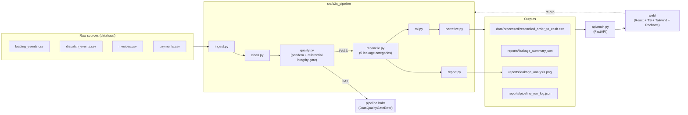

# KPC Order-to-Cash Leakage Reconciliation

**Inuka Hackathon — Problem 7D** (Domain D: Revenue Assurance, Billing & Reconciliation)
**Stage 1 — Data Engineering** · Lameck Irungu

Reconciles Kenya Pipeline Company's product **loading → dispatch → invoice → payment**
cycle and quantifies, in Kenyan shillings, exactly where order-to-cash revenue leaks —
before it becomes a surprise at month-end audit.

See [`reports/PROBLEM_FRAMING_MEMO.md`](reports/PROBLEM_FRAMING_MEMO.md) (or the PDF at
`reports/Inuka_Stage1_Memo_Lameck.pdf`) for the one-page business case.

## Architecture



**Two services, one container in production.** `api/` is a FastAPI backend exposing the
pipeline's output as JSON (`/api/kpis`, `/api/exceptions`, `/api/roi`, `/api/narrative`,
`/api/data-quality`, `POST /api/pipeline/run`, ...). `web/` is a real single-page app —
Vite + React 19 + TypeScript + Tailwind v4 + Recharts, not a Python dashboard framework —
with live filters, an exceptions/audit-trail table, an ROI & business-case view, and a
data-quality panel. In Docker, the frontend is built to static assets and served by the
same FastAPI process; in local dev they run as two processes (`make api-dev` +
`make web-dev`) with Vite proxying `/api` to the backend.

CI (`.github/workflows/ci.yml`) runs three jobs on every push: Python lint/test/quality-gate,
frontend type-check/lint/build, then a Docker build that smoke-tests both `/api/health` and
`/` before passing.

## Quickstart

```bash
make setup          # venv + editable install (pandas, pandera, fastapi, uvicorn, ...)
make generate-data   # synthetic-but-messy KPC exports -> data/raw/ (deterministic, seed=42)
make pipeline        # ingest -> clean -> quality gate -> reconcile -> reports/
make test            # 31 unit + integration tests (pipeline + API)
make lint             # ruff (python) + oxlint (frontend)
```

Then, in two terminals:

```bash
make api-dev         # FastAPI backend  -> http://localhost:8010
make web-install && make web-dev   # React dashboard -> http://localhost:5173
```

Or containerized (single service, frontend pre-built):

```bash
make docker-run      # docker compose up --build -> http://localhost:8020
```

The dashboard's "Re-run pipeline" button calls `POST /api/pipeline/run`, which calls the
exact same `run_pipeline()` entry point as `make pipeline` and the CI job — there is one
pipeline, not a demo copy and a real one.

## What the pipeline finds

Every loading is valued at what it *should* be worth (volume × ex-depot price) and then
debited across five **mutually exclusive** categories, so they always sum to total
leakage with no double counting:

| Category | Meaning |
|---|---|
| Dispatch capture gap | Loaded, but no dispatch record exists at all |
| Shrinkage | Dispatched volume is materially below loaded volume |
| Billing gap | Confirmed dispatch, but never invoiced |
| Underbilling | Invoiced for less volume than was dispatched |
| Collections gap | Invoiced correctly, but payment is partial or outstanding |

On the committed synthetic dataset (45 days, 6 depots, 3 products, 20 customers —
illustrative, not live KPC data): **5.5% of expected ex-depot revenue leaks** before it
converts to collected cash (~KES 689M over the window, ~KES 5.6B annualized), concentrated
in a handful of depots and customers. Full numbers, an AI-generated executive narrative,
and an ROI model (with explicit, adjustable recovery-rate assumptions per category) are in
`reports/leakage_summary.json` and the dashboard's "ROI & Business Case" tab.

## Data-quality gates

`quality.py` draws a hard line between two different things:

- **Structural defects** (wrong dtype, orphan foreign keys, duplicate primary keys,
  malformed dates) — these fail the gate above a small tolerance, and the pipeline halts
  before reconciling data it can't trust.
- **Business gaps** (a dispatch with no invoice, an invoice with no payment) — these are
  exactly the phenomenon this pipeline exists to measure. They are never a gate failure;
  they are `reconcile.py`'s job.

## Repository layout

```
src/o2c_pipeline/   ingest, clean, quality, reconcile, roi, narrative, report, pipeline
api/                 FastAPI backend (kpis, trend, exceptions, roi, narrative, dq, re-run)
web/                 React + TypeScript + Tailwind + Recharts dashboard
scripts/             synthetic data generator + PDF memo renderer
tests/                31 pytest tests (cleaning, quality gate, reconciliation math, API, e2e)
data/raw/            committed synthetic source exports (deterministic, seed=42)
data/processed/      pipeline output (reconciled dataset, DQ issue log)
reports/              summary JSON, chart, memo, pipeline run log
.github/workflows/    CI: python + frontend lint/test/build, Docker build + health check
Dockerfile, docker-compose.yml   multi-stage build; one container serves API + frontend
```

## Roadmap

- **Stage 2:** connect to live KPC extracts; statistical diagnostics and a predictive
  shrinkage/collections-risk model on top of this reconciliation foundation.
- **Stage 3:** harden into the monitored, CI/CD-deployed service this repo already points
  at, and validate the ROI model against real recovery data.
